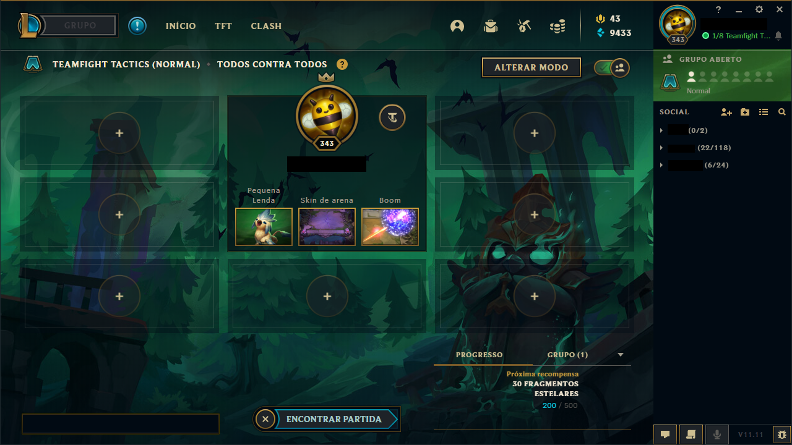

# Emblem Miner Bot (EMB)

## pt-br
Um bot de TFT utilizado para *farmar* tokens de passe feito com Python

O que você vai precisar para funcionar
* Python 3
* LoL
* Passe do evento
* Resolução do client do LoL em 1280x720
* Resolução do jogo em 1600x900

Depois de ter esses itens instalados, você vai precisar de executar esses comandos no terminal para instalar as dependencias necessárias pro funcionamento do script.
```python
pip install pygetwindow
pip install pyautogui
```

É necessário que o cliente esteja na tela de *lobby* do jogo TFT



Após tudo pronto, pode se executar o seguinte comando dentro da pasta/diretório do script:
```
python .\bot.py
```
## en
A TFT bot used to farm event pass tokens made with Python

1280x720
1600x900